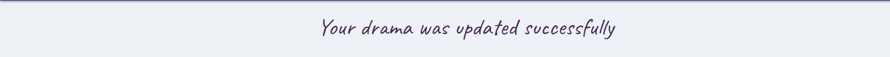
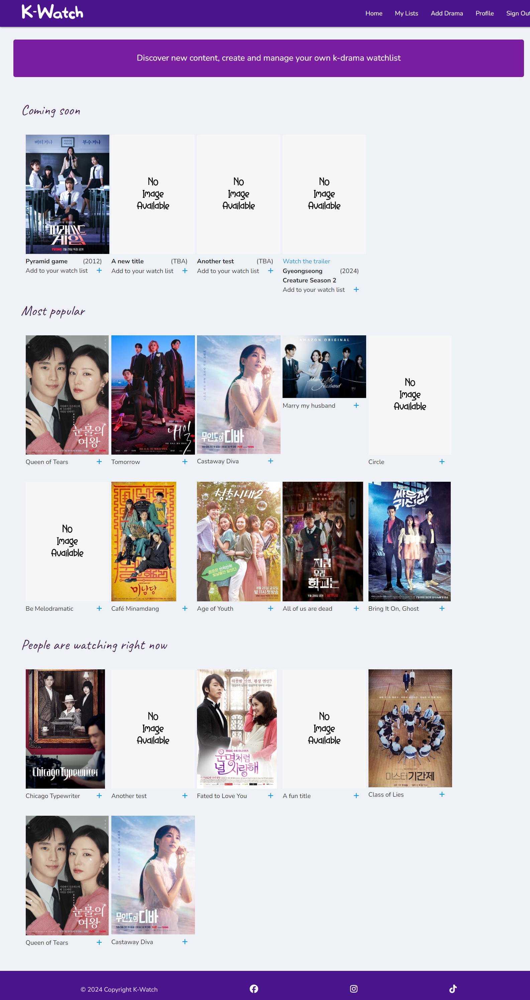

# K Watch

K Watch is a website for Korean drama watchers to keep a track of what they are watching. They can add a drama to their list with details such as the status (Plan to watch, Currently watching, Completed or Dropped), number of episode they have watched, give a rating etc. They can then edit each entry as necessary. On the homepage, users can see information on upcoming dramas, most popular dramas as rated by other users and what others are currently watching. On their profile page, they can see personal stats such as what they have recently completed. 


The live link can be found [here](https://kwatch-c574d8ada52e.herokuapp.com/)


## User stories

### First time visitor goals:
*	I want to have a way to store information on dramas I have been watching
*   I want to have images so it is visually appealing and I know which drama is listed
*   I want to see enough recommendations for me to think it is worthwhile for me to make an account and start watching dramas

### Returning visitor goals:
*	I want the site to be easy to navigate so I can quickly find what I need
*	I want to be able to create an account and easily update my information
*   I want to see what others are watching so that it may encourage me to watch it too

### Frequent visitor goals:
*	I want to keep a track on my watch list and edit it as I progress
*   I want to see updated information such as upcoming dramas so there is a reason to keep updating my list
*	I want to see recommendations on what others are watching so I can maybe add it to my own list
*	I want to see my own stats to get an idea of my watching habits
*   I want to be able to filter my list according to its status

### Admin goals:
*   As an admin I want to be able to manage the list of upcoming shows so that I can provide updated information to the users
*   As an admin I want the managing process to be easy and quick so that I don't lose motivation
*   As an admin, I don't want other users to be able to change the upcoming dramas list as the information may be incorrect


## Wireframes


## Features

### Navbar

*   All pages include a navbar which becomes a collapsibe navbar for small screens
*   It includes links to sign in/out, register, homepage, lists page, add drama page and profile page
*   The links available will depend on whether a user is signed in or not


### Footer

* This includes a copyright message and links to Facebook, Instagrama nd Tiktok which open in a new window


### Flash messages

*   Flash messages appear to confirm that an action has been completed for example a new drama has been added or deleted
*   They are styled to not be too distracting to ensure a good user experience



### Sign in

*   Users are asked to provide the email address and password they used to register
*   If they have not registered yet, there is a link directing them to the sign up page


### Register

*   Users are asked to provide a username, email address, password and confirmation of the password
*   If the username already exists, they will be alerted to select a different one
*   If they already have an account, there is a link directing them to the sign in page


### Home page

*   This features a 'Coming soon' section which only admin can add to, edit and remove. Admin can add information including title, image URL, release date and link to a trailer


*   The 'Most popular' list feature dramas which users have added to their list which have a rating greater or equal to 7. It is shuffled every time the page is refreshed and sliced to 10 items 
*   Similarly, 'People are watching right now' section features dramas that users have added to their currently watching list. It is shuffled every time the page is refreshed and sliced to 10 items



*   If no video link is provided, it will not appear to users
*   If no image URL is provided, the default image will be used
*   Users are able to add dramas from any of theses lists to their own should they wish to. If users are not signed in, the link will direct the user to the sign in page


### My lists

*   This includes a list of all shows that user has added and displays it into a table in alphabetial order


*   The table has a thumbnail to open up a modal including information on each drama. It also shows the title, year, number of episodes, the user's progress and rating.


*   The table is responsive and will hide the 'year' and 'episodes' columns for mobile screens
*   Users can also edit and delte each drama from their database
*   The navbar allows users to filter dramas by status: All dramas, Plan to watch, Currently watching, Completed and Dropped
*   It turns into a dropdown menu for small screens
*   Users can also search through their lists with the search bar. If there is no result, they will be alerted


### Add / Edit drama

*   This is where users add dramas to their database


*   Users can edit information for any drama added to their list
*   Fields are pre-populated with current information


*   Fields for both pages include title, image link, year, number of episodes, status, episodes watched, rating and notes
*   Title, Year, Number of episodes and status are required
*   The star rating can be cleared and the clear button at the bottom will refresh the page
*   As users are adding an image URL rather than uploading their own, there is a warning that the image could be deleted by the image owner and they are able to replace it should that happen
*   If no image is provided, a default image will be used

### Profile

*   Users can edit their profile information or delete their account by clicking on the settings button. This will open up a modal
*   For users to delete their account entirely, they must click the delete button which will reveal a confirmation. this is for extra security and to avid their account being accidentally deleted


*   This page lists dramas that users are currently watching and ones they have not yet given a rating to
*   It also lists dramas they have recently completed (limited to 10) and highly rated (rating is greater or equal to 7). Both of these are displayed in a carousel


## Technologies Used

### Languages

* [HTML](https://developer.mozilla.org/en-US/docs/Web/HTML)
* [CSS](https://developer.mozilla.org/en-US/docs/Web/CSS)
* [Javascript](https://developer.mozilla.org/en-US/docs/Web/JavaScript)
* [Python](https://developer.mozilla.org/en-US/docs/Glossary/Python)
* [Jinja](https://jinja.palletsprojects.com/en/3.1.x/)

### Libraries

* [JQuery](https://jquery.com/) was used to reset the star rating
* [Materialize CSS](https://materializecss.com/) I used features including Navbar, Modals, Dropdown, Carousel, Cards, Buttons and Form components. I also used their CSS components including color , table and grid
* [Google fonts](https://fonts.google.com/) was used for fonts
* [Font awesome](https://fontawesome.com/) was where I got the icons displayed on forms and buttons

### Other tools

* [mongoDB](https://mongodb.com/) was used for my non-relational database
* [Flask](https://flask.palletsprojects.com/en/3.0.x/) was the framework I used to add logic to my HTML pages
* [Flexbox](https://developer.mozilla.org/en-US/docs/Learn/CSS/CSS_layout/Flexbox) was used to make the pages responsive
* [Balsamiq](https://balsamiq.com/) was used to make wireframes
* [Git](https://git-scm.com/) was used for source control management
* [Gitpod](https://gitpod.io/) was used to write and edit code
* [GitHub](https://github.com/) was used to store code for the website
* [Heroku](https://heroku.com/) hosts the website
* [Adobe photoshop](https://www.adobe.com/uk/products/photoshop.html) was used to crop images for the README.md file
* [Adobe Illustrator](https://www.adobe.com/uk/products/illustrator.html) was used to create the logo
* [Chrome dev tools](https://developer.chrome.com/docs/devtools) was used for debugging and to check responsiveness


## Testing

Please refer [here](TESTING.md) for all information on testing


## Deployment

* To make a local copy of this project, you can clone the repository by typing the following command into your IDE terminal:

 `git clone https://github.com/nhamidi90/k-watch.git`

* Alternatively, to open the workspace in Gitpod, you can [click here](https://gitpod.io/#https://github.com/nhamidi90/k-watch)
* Go to mongoDB and create your own mongoDB database and collections
* Go to the Heroku dashboard an select 'Create new app'
* Enter a unique name and select your region. Click 'Create App'.
* Inside your project, go to the settings tab and select the 'Reveal config vars' button
* Add in the following variables making sure there are no quotation marks and replacing SECRET_KEY, MONGO_URI and MONGO_DBNAME with your own details
```
IP : 0.0.0.0
PORT : 5000
MONGO_DBNAME : Your MongoDB database name
MONGO_URI : Your mongoDB URI. You can find this on MongoDB by going to Database > Connect > Drivers (under connect to your application where it says 'Add your connection string into your application code')
SECRET_KEY : Your secret key
```
* Go to the Deploy tab and choose 'Connect to Github'
* Select your repository name and select Connect
* Scroll to the bottom and click 'Deploy branch'
* You can then view your app by clicking on 'Open app'


## Future Improvements
*   It appears that it would be beneficial to work with JQuery as opposed to vanilla javascript from the start as some of the code I used to troubleshoot used JQuery
*   As it is not ideal to add images via a URL link, I would have like to connect to a Kdrama API as that would already have a large library of dramas including images. Users would then be able to select from the list with the details already at hand rather than having to search and input themselves
*   It would be great if users could connect and see each others' lists as this would encourage more usage of the site and more watch time
*   It would also be nice for users to be able to upload their own profile picture
*   The website has potential to grow more complicated databases by adding and filtering queries such as whether it is a tv show or movie and also add dramas from other countries
*   I would like to make my 'add drama' forms more dynamic so that when a particular status is selected, relevent fields will become visible. For example, users can only see the star rating if they have selected completed or dropped
*   As watch lists can grow quite long, it would be benficial to introduce pagination


## Credits

### Content
* for the purpose of this project, I decided to input existing drama information into the database to simulate real-world usage by getting data from [My drama list](https://mydramalist.com/) and also to give me an idea of what features to add

### Media

Here are the images I used 

*   https://upload.wikimedia.org/wikipedia/en/e/e2/Queen_of_Tears_poster.png
*   https://upload.wikimedia.org/wikipedia/en/3/3a/Tomorrow_%282022%29.jpg
*   https://i.mydramalist.com/gWz4Wf.jpg
*   https://encrypted-tbn1.gstatic.com/images?q=tbn:ANd9GcTujmtz_krfwIsrUzeIVlFwY3YbvU827_rnkMUN72tSHyZ4upXa
*   https://m.media-amazon.com/images/S/pv-target-images/825d2b8dc5598f3be2bd68f19a089702a4535e81dd9ed67962c514278e651193.png
*   https://upload.wikimedia.org/wikipedia/en/a/a0/Beautiful_Gong_Shim_poster.jpg
*   https://upload.wikimedia.org/wikipedia/en/7/72/Hey_Ghost%2C_Let%27s_Fight_-_Poster.jpg
*   https://upload.wikimedia.org/wikipedia/en/2/24/All_of_Us_Are_Dead.jpeg
*   https://upload.wikimedia.org/wikipedia/en/f/fe/Caf%C3%A9_Minamdang.jpg
*   https://upload.wikimedia.org/wikipedia/en/thumb/4/44/Diva_of_the_Deserted_Island.jpg/250px-Diva_of_the_Deserted_Island.jpg
*   https://upload.wikimedia.org/wikipedia/en/6/64/Crash_Landing_on_You_main_poster.jpg
*   https://m.media-amazon.com/images/M/MV5BNThlM2ZjYzItYzhmYS00MjI5LTg5YTAtYzZlN2FjNmIwYzc3XkEyXkFqcGdeQXVyMTMxODk2OTU@._V1_.jpg
*   https://m.media-amazon.com/images/M/MV5BODNmNzhlYzItYjJjMC00YTUyLWJhMTQtZWRmY2JhM2RiNTljXkEyXkFqcGdeQXVyMTAwMzM3NDI3._V1_FMjpg_UX1000_.jpg
*   https://upload.wikimedia.org/wikipedia/en/thumb/8/8a/KillMeHealMe-Poster.jpg/220px-KillMeHealMe-Poster.jpg
*   https://m.media-amazon.com/images/M/MV5BNmYzZTM4MmEtNTZjZi00M2YxLWE3ZGEtOTc2NThlYWEyZTY2XkEyXkFqcGdeQXVyMzE4MDkyNTA@._V1_FMjpg_UX1000_.jpg
*   https://upload.wikimedia.org/wikipedia/en/b/b5/Pyramid_Game_%28TV_series%29_poster.jpg
*   https://encrypted-tbn1.gstatic.com/images?q=tbn:ANd9GcTujmtz_krfwIsrUzeIVlFwY3YbvU827_rnkMUN72tSHyZ4upXa

### Tools
* [Amiresponsive](https://ui.dev/amiresponsive) was used to create a mockup of the website for the README
* [Responsive viewer](https://responsiveviewer.org/) was used to check how the website looks on different devices

### Code
* [Stack overflow](https://stackoverflow.com/questions/31607710/randomize-elements-of-a-list-in-jinja-2) was used to shuffle my lists
* [Codepen](https://codepen.io/melaniexx/pen/GRgBeKW) by Melanie was used to reset the star rating
* This walkthrough by [codexdude](https://www.youtube.com/watch?v=zDHC4r5eCdY) was used to create a star rating
* [Materialize CSS](https://materializecss.com/) components were used a lot throughout this project
* [Code Institute](https://codeinstitute.net/) I referred to lessons and source code from Code Institute's Web Application Development course
* I also got the code for custom Materialize validation from Code Institute
* Some code from [geeksforgeeks](https://www.geeksforgeeks.org/how-to-create-a-thumbnail-image-using-html-and-css/) was used to create thumbnails for the 'My lists' page
* [W3schools](https://www.w3schools.com/html/html_favicon.asp) gave me the method to add a favicon

### Acknowledgements

*   Thank you to the tutors at Code Institute who have helped me when I was stuck 
*   Thank you to my mentor Juliia Konovalova for guiding me through this project