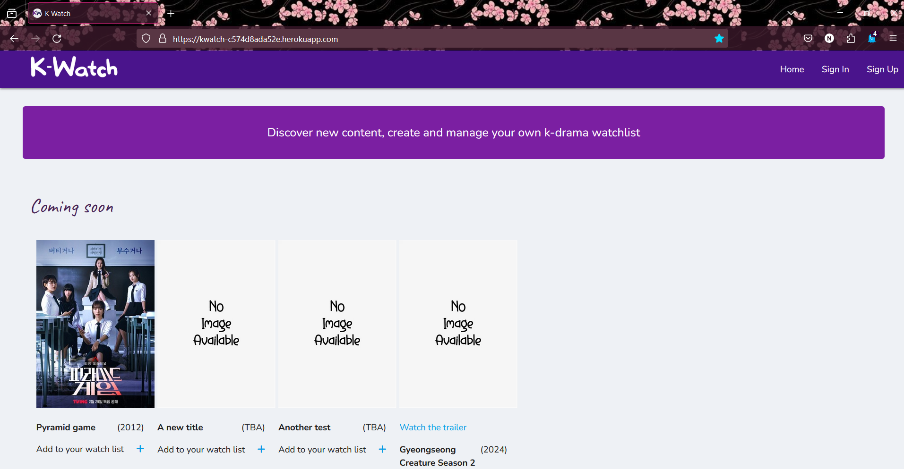
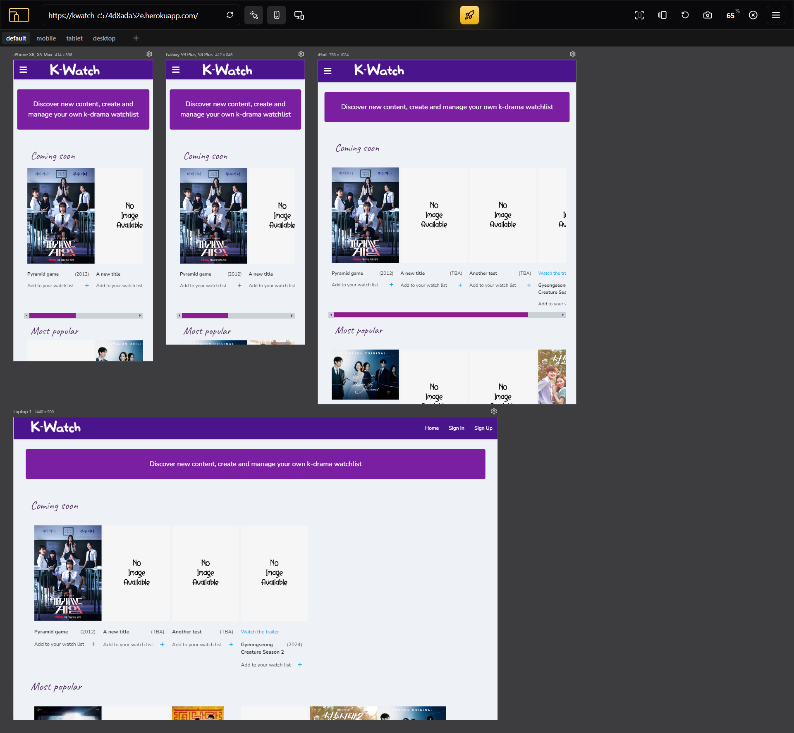
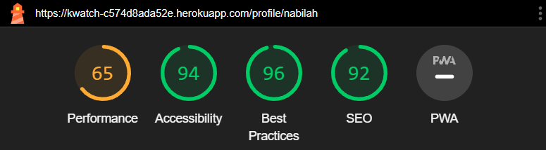

# TESTING

## Compatibility and responsiveness

* The website was tested on three browsers to determine correct appearance, responsiveness and to ensure it works well
* It was tested on Chrome, Firefox and Opera

Chrome:

Firefox:

Opera:

* The responsiveness of the site was also tested using chrome devtools. Devices tested include:

    - iPhone SE
    - iPhone XR
    - iPhone 12 Pro
    - Pixel 5
    - Samsung Galaxy S8+
    - Samsung Galaxy S20 Ultra
    - iPad Mini
    - iPad Air
    - Surface Pro 7
    - Surface Duo
    - Galaxy Fold
    - Samsung Galaxy A51/71
    - Nest Hub
    - Nest Hub Max
    - Laptop

I personally tested the website on Dell Inspiron 5000 laptop and OnePlus Nord 2T mobile

Here is the website tested on different devices:

* Sign In Page

* Sign Up Page

* Home Page

* My Lists Page

* Add Drama Page

* Edit Drama Page

* Profile Page

## Manual testing

|feature	|action	|expected result|	tested	|passed	|comments|
|-----------|-------|---------------|-----------|-------|--------|
|**Navbar**	|
|Logo |Click on the logo| users will be directed to the home page | Yes | Yes | - |
|Home |Click on home| users will be directed to the home page | Yes | Yes | - |
|My lists |Click on my lists| users will be directed to the my lists page | Yes | Yes | Only visible if users are signed in |
|Add drama |Click on add drama| users will be directed to the add drama page | Yes | Yes | Only visible if users are signed in |
|Profile |Click on profile| users will be directed to the profile page | Yes | Yes | Only visible if users are signed in |
|Sign out |Click on sign out| users will be signed out and directed to sign in page| Yes | Yes | Only visible if users are signed in |
|Sign in |Click on sign in| users will be directed to the sign in page | Yes | Yes | Only visible if users are not signed in. Flash message if details are incorrect |
|Sign up |Click on sign up| users will be directed to the register page | Yes | Yes | Only visible if users are not signed in. Flash message if user already exists |
|**Home Page**					|
|Add new drama |Click on the "Add new drama" button| Modal opens and admin can add a new entry | Yes | Yes | For admin only. Flash message will appear |
|Edit |Click on the "Edit" button| Modal opens and admin can edit entry. Form is pre-populated | Yes | Yes | For admin only |
|Remove |Click on the "Remove" button| Deletes entry | Yes | Yes | For admin only. Flash message will appear |
|Add to your watch list |Click on the "Plus" icon| Modal opens and users can add drama to their watch list. Form is pre-populated | Yes | Yes | - |
|**My Lists Page**					|
|Search|Type in the search bar and click search button| Query will be displayed | Yes | Yes | Message if no results |
|Reset|Click on reset button| Query will be reset | Yes | Yes | - |
|All dramas |Click on "All dramas"| All dramas table will be displayed | Yes | Yes | - |
|Plan to watch |Click on "Plan to watch"| Plan to watch table will be displayed | Yes | Yes | - |
|Currently watching |Click on "Currently watching"| Currently watching table will be displayed | Yes | Yes | - |
|Completed |Click on "Completed"| Completed table will be displayed | Yes | Yes | - |
|Dropped |Click on "Dropped"| Dropped table will be displayed | Yes | Yes | - |
|Thumbnail|Click on thumbnail| Modal will open with drama information | Yes | Yes | - |
|Edit |Click on pencil icon| Users will be directed to edit drama page. Form is pre-populated | Yes | Yes | Flash message will appear |
|Delete |Click on bin icon| Drama will be removed from the table | Yes | Yes | Flash message will appear |
|**Add Drama Page**					|
|Star rating |Click on a star| Rating will be displayed and stars highlighted | Yes | Yes | - |
|Eraser |Click on eraser icon| Star rating will be cleared | Yes | Yes | - |
|Clear |Click on "Clear"| Form will be reset | Yes | Yes | - |
|Submit |Click on "Submit"| Drama will be added to the database. Users are redirected to my lists page | Yes | Yes | Flash message will appear |
|**Add Drama Page**				|
|Star rating |Click on a star| Rating will be displayed and stars highlighted | Yes | Yes | - |
|Eraser |Click on eraser icon| Star rating will be cleared | Yes | Yes | - |
|Clear |Click on "Clear"| Form will be reset | Yes | Yes | - |
|Submit |Click on "Submit"| Drama will be edited Users are redirected to my lists page | Yes | Yes | Flash message will appear |
|**Profile Page**					|
|Settings |Click on the "Settings" button |Modal will open. Users can edit their profile|	Yes	|Yes|	-|
|Modal cancel button |Click on cancel| Modal will close | Yes | Yes | - |
|Modal edit profile |Click on the "Edit profile" button |The user's profile will be changed|	Yes	|Yes|Flash message will appear|
|Modal Delete button |Click on the "Delete" button |A section will appear confirming the user wants to delete their profile|	Yes	|Yes| The button toggles between hiding and showing the confirmation|
|Modal No button |Click on No| Modal will close | Yes | Yes | - |
|Modal Yes button |Click on Yes| Profile will be deleted. Users will be redirected to register page | Yes | Yes | - |

## Validator testing

### HTML

The website was tested using the [W3C HTML Validator](https://validator.w3.org/nu/) tool

*   Sign up

*   Sign in

*   Homepage

*   My lists

*   Add drama

*   Edit drama

*   Profile

*   The warning of empty heading is due to that being the container for the star rating. This will be filled once users select a rating
*   I am aware of the warning that section lacks heading but it is my decision to keep this structure

### CSS

The website passed all tests using the [W3C CSS validator](https://jigsaw.w3.org/css-validator/) tool

### Javascript

The results for javascript validation using the official [JSHint](https://jshint.com/) validator is as follows:

### Python

To ensure the python code is PEP8 cimpliant, I used the [Code Institute Python Linter](https://pep8ci.herokuapp.com/):

## Lighthouse report

*   Sign up

*   Sign in

*   Homepage

*   My lists

*   Add drama

*   Edit drama

*   Profile

## Bugs

*   I tried to hide a section on the settings modal on the profile page but I found that vanilla javascript wasn't working. I then had to use jQuery to toggle the section
*   The ratings on the home page would not work for most of the shows when trying to add them to your own list. Only the first one would work. It was evident that I had to give each star a unique id and also for the container which displays the rating
*   The custom materialize vallidation code would not work on the select menu in the modals. For this to work I had to add new event listeners to the dropdown-trigger class. However, it still does not work if a user has not selected an option and proceeds to click the submit button

## Mistakes

*   A mistake I made was that sometimes when clicking on the thumbnail on the lists page, the modal would not open or it would open inside another modal. I discovered that there were missing closing `
` tags